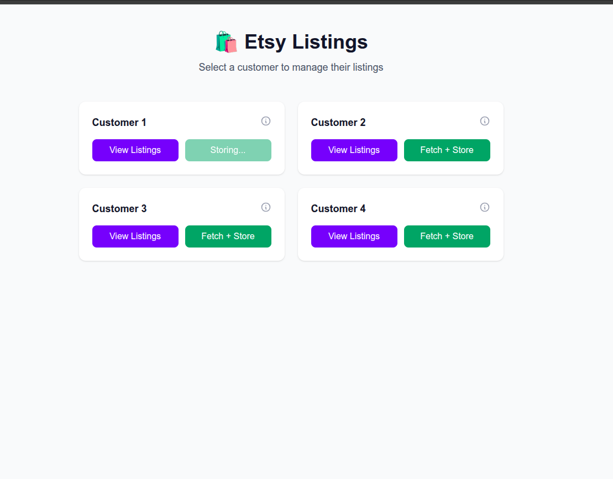
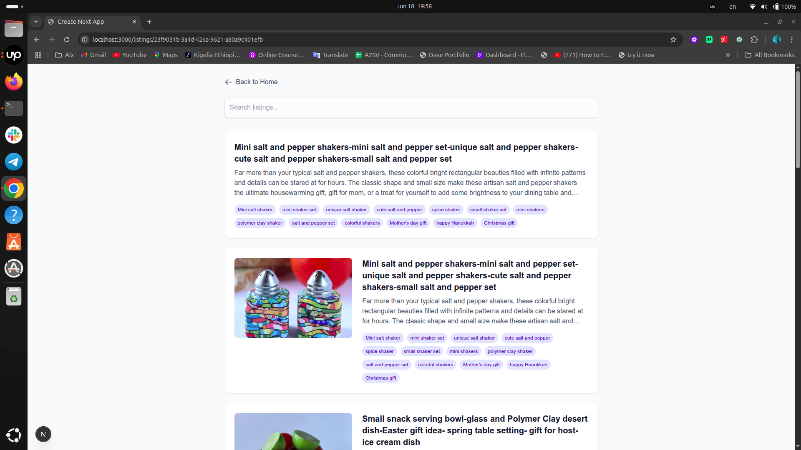

# 🛍️ Etsy Listing Scraper + Viewer (Full Stack)

This project fetches Etsy listings via a remote API, stores them in a local MongoDB database (if not already present), and provides an interface for searching and paginating the listings via a frontend UI built with **Next.js**.

---

## 🧩️ Stack

| Layer      | Tech                                                      |
| ---------- | --------------------------------------------------------- |
| Backend    | Express.js + Mongoose                                     |
| Database   | MongoDB                                                   |
| Frontend   | Next.js 15 + Tailwind CSS                                 |
| API Source | `https://etsy-test.onrender.com/api/listings/:customerId` |

---

## ⚙️ Features

* 📦 Fetch + insert new Etsy listings per `customerId`
* 🧠 Skips duplicates by checking `listing_id`
* 🔎 Search listings by title/description
* 🔄 Paginate results from MongoDB
* 🌐 Next.js frontend with Tailwind UI
* 🚀 Fully local dev + API-ready for production

---

## 🏗️ Setup Instructions

### 🔧 Backend

1. **Install dependencies**

```bash
cd backend
npm install
```

2. **Set up `.env`**

```env
PORT=5000
MONGO_URI=mongodb://127.0.0.1:27017/etsyDB
```

3. **Run the server**

```bash
npm run dev
```

The backend will be available at `http://localhost:5000`.

---

### 💻 Frontend (Next.js + Tailwind)

1. **Install dependencies**

```bash
cd frontend
npm install
```

2. **Run the frontend**

```bash
npm run dev
```

The frontend will be available at `http://localhost:3000`.

---

## 📱 API Endpoints

### `GET /api/listings/fetch/:customerId`

Fetches and stores new listings from the Etsy API.

---

### `GET /api/listings`

Query listings with pagination + search

```bash
GET /api/listings?customerId=abc-123&search=shirt&offset=0&limit=10
```

Returns:

```json
{
  "total": 50,
  "listings": [ ... ]
}
```

---

## 🧪 Test It

Try:

```bash
curl http://localhost:5000/api/listings/fetch/23f9031b-3a4d-426a-9621-a80a9c401efb
```

Then open the frontend and see the results!

---

## 🗃️ MongoDB Schema (Listing)

```js
{
  listingId: String, // from Etsy's listing_id
  customerId: String,
  title: String,
  description: String,
  tags: [String],
  image: String,
  images: [String],
}
```

---

## 📸 Screenshots



---

## 👤 Author

Made with ❤️ by Fita Wegene
🌐 GitHub: [@fi-taa](https://github.com/fi-taa)

---

## 📄 License

MIT – free to use, remix, ship, and sell 🚢
